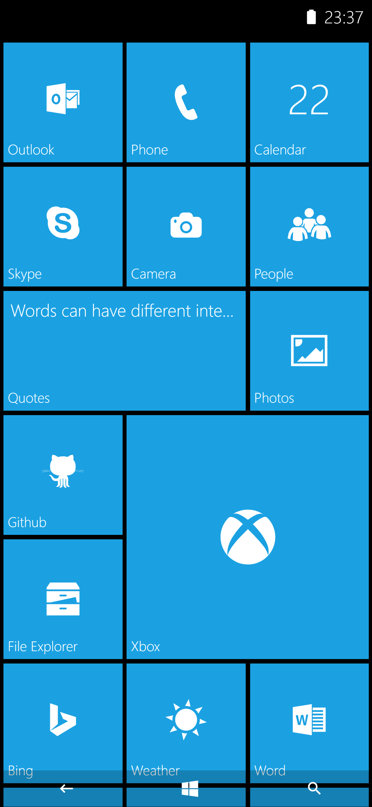
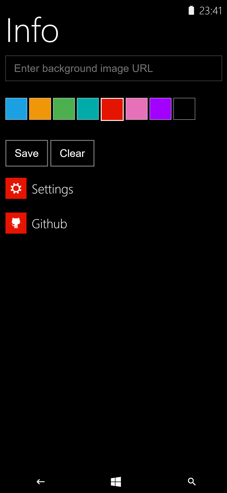
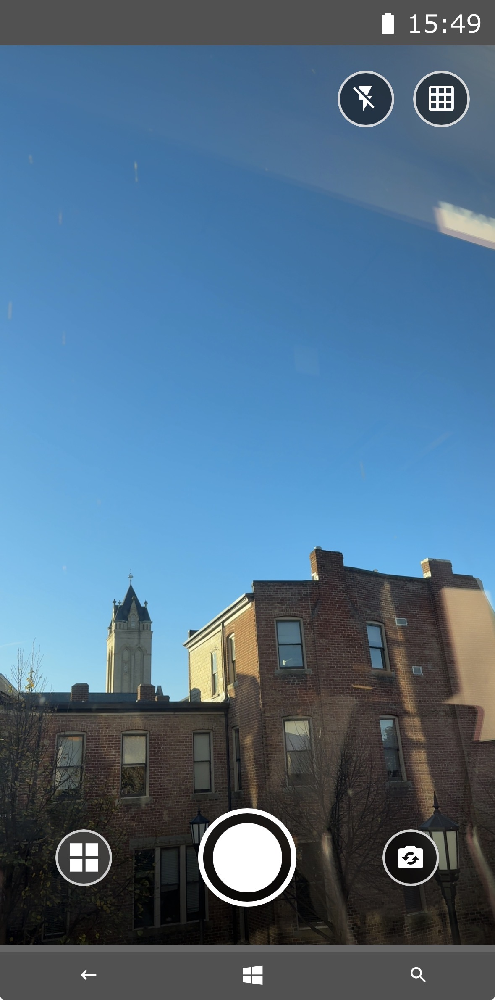
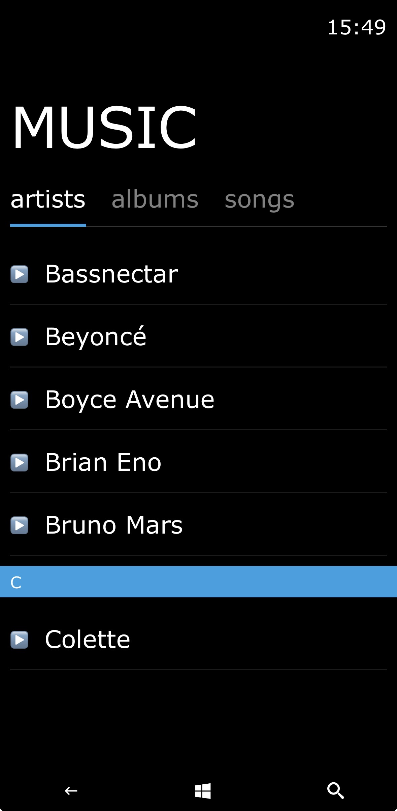
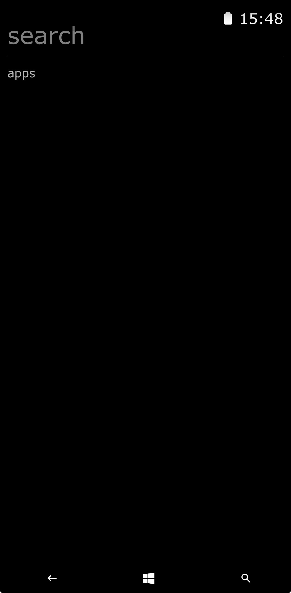
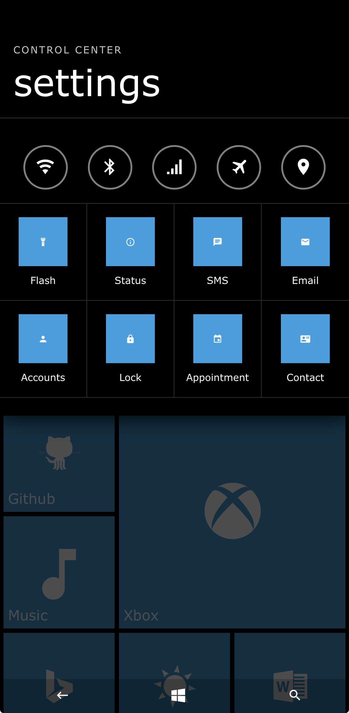

## Windows Phone Web UI

## Forked from 4rnv/metro
### Make Launcher more functional, starting with it opening IOS apps and overtime make native apps for emulator

### Original Features before Forked:

<table>
  <tr>
    <td></td>
    <td></td>
    <td></td>
  </tr>
  <tr>
    <td align="center">Classic Start screen</td>
    <td align="center">Start with image background</td>
    <td align="center">Settings</td>
  </tr>
</table>

### Features Added:

<table>
  <tr>
    <td></td>
    <td></td>
    <td></td>
    <td></td>
  </tr>
  <tr>
    <td align="center">Camera App</td>
    <td align="center">Music App</td>
    <td align="center">Search Page</td>
    <td align="center">Control Center</td>
  </tr>
</table>

### Features To Add
- Weather App
- Working Music App
- Smoother Animations & Better Functionality